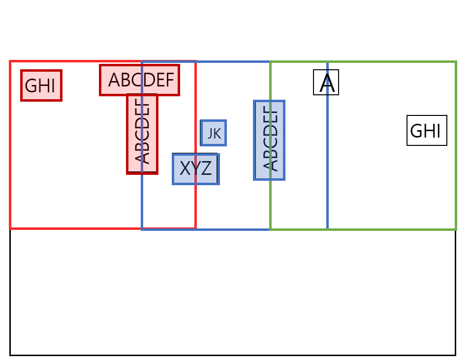

# CIMR
### : Crop big Image and Merge detected Results (A tool for text or object detection)

## Abstract :rocket:

Getting in trouble with using **big images** when you try to recognize something? :anguished: ex) 'out of memory' error  
and there is no tool to solve it?  
Then check out CIMR :smile:  

## Usage :eyes:  

1. Prepare detection, recognition engines you prefer.
2. Use CIMR to crop a big image into proper size.
3. Run your own detection engine with the cropped images.
4. Use CIMR to merge the detected box results from cropped images into one complete result file.
5. Run your own recognition engine with the merged detection result.  

See `example.py` 

## Details :mag_right:

If we crop a image without stride, some cases which can't detect **full** texts (or obejcts) could exist as you can see in the picture below.   

   

So, CIMR will crop an image with stride.   

###  

Now we have overlapped area and thus we need an algorithm which can merge the detected results properly. (with no missing or overlapping)  
If we can merge the detection results, we can just use the box positions to recognize the texts.   

  
  
 
The idea is including the boxes into a result which detected before the left boundary of the next cropped image  
and excluding the boxes which detected at the left boundary of the current cropped image.  
 
  

Then it makes a result like below. (Colored boxes are the included results.)

  

And applying it vertically in the same way,  
 
